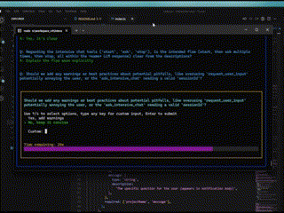

# interactive-mcp (Enhanced Fork)

> **Fork Note**: This is an enhanced fork of [ttommyth/interactive-mcp](https://github.com/ttommyth/interactive-mcp) with the following improvements:
> - **Auto-pause countdown timer** when user starts typing
> - **Silent logging** - logs are written to files only, not to stdio/terminal
> - **Better user experience** with visual pause indicators

[](https://www.npmjs.com/package/interactive-mcp) [](https://www.npmjs.com/package/interactive-mcp) [](https://smithery.ai/server/@ttommyth/interactive-mcp) [](https://github.com/ttommyth/interactive-mcp/blob/main/LICENSE) [](https://github.com/prettier/prettier) [](https://github.com/ttommyth/interactive-mcp) [](https://github.com/ttommyth/interactive-mcp/commits/main)


A MCP Server implemented in Node.js/TypeScript, facilitating interactive communication between LLMs and users. **Note:** This server is designed to run locally alongside the MCP client (e.g., Claude Desktop, VS Code), as it needs direct access to the user's operating system to display notifications and command-line prompts.

_(Note: This project is in its early stages.)_

**Want a quick overview?** Check out the introductory blog post: [Stop Your AI Assistant From Guessing — Introducing interactive-mcp](https://medium.com/@ttommyth/stop-your-ai-assistant-from-guessing-introducing-interactive-mcp-b42ac6d9b0e2)

[Demo Video](https://youtu.be/ebwDZdfgSHo)

<div align="center">
<a href="https://glama.ai/mcp/servers/@ttommyth/interactive-mcp">
  
</a>
</div>

## Tools

This server exposes the following tools via the Model Context Protocol (MCP):

- `request_user_input`: Asks the user a question and returns their answer. Can display predefined options. **Enhanced**: Timer auto-pauses when user types.
- `message_complete_notification`: Sends a simple OS notification.
- `start_intensive_chat`: Initiates a persistent command-line chat session.
- `ask_intensive_chat`: Asks a question within an active intensive chat session.
- `stop_intensive_chat`: Closes an active intensive chat session.

## Demo

Here are demonstrations of the interactive features:

|                      Normal Question                       |                       Completion Notification                       |
| :--------------------------------------------------------: | :-----------------------------------------------------------------: |
|  |  |

|                         Intensive Chat Start                         |                        Intensive Chat End                        |
| :------------------------------------------------------------------: | :--------------------------------------------------------------: |
|  |  |

## Usage Scenarios

This server is ideal for scenarios where an LLM needs to interact directly with the user on their local machine, such as:

- Interactive setup or configuration processes.
- Gathering feedback during code generation or modification.
- Clarifying instructions or confirming actions in pair programming.
- Any workflow requiring user input or confirmation during LLM operation.

## Client Configuration

This section explains how to configure MCP clients to use the `interactive-mcp` server.

By default, user prompts will time out after 30 seconds. You can customize server options like timeout or disabled tools by adding command-line flags directly to the `args` array when configuring your client.

Please make sure you have the `npx` command available.

### Usage with Claude Desktop / Cursor

Add the following minimal configuration to your `claude_desktop_config.json` (Claude Desktop) or `mcp.json` (Cursor):

```json
{
  "mcpServers": {
    "interactive": {
      "command": "npx",
      "args": ["-y", "interactive-mcp"]
    }
  }
}
```

**With specific version**

```json
{
  "mcpServers": {
    "interactive": {
      "command": "npx",
      "args": ["-y", "interactive-mcp@1.9.0"]
    }
  }
}
```

**Example with Custom Timeout (30s):**

```json
{
  "mcpServers": {
    "interactive": {
      "command": "npx",
      "args": ["-y", "interactive-mcp", "-t", "30"]
    }
  }
}
```

### Usage with VS Code

Add the following minimal configuration to your User Settings (JSON) file or `.vscode/mcp.json`:

```json
{
  "mcp": {
    "servers": {
      "interactive-mcp": {
        "command": "npx",
        "args": ["-y", "interactive-mcp"]
      }
    }
  }
}
```

#### macOS Recommendations

For a smoother experience on macOS using the default `Terminal.app`, consider this profile setting:

- **(Shell Tab):** Under **"When the shell exits"** (**Terminal > Settings > Profiles > _[Your Profile]_ > Shell**), select **"Close if the shell exited cleanly"** or **"Close the window"**. This helps manage windows when the MCP server starts and stops.

## Development Setup

This section is primarily for developers looking to modify or contribute to the server. If you just want to _use_ the server with an MCP client, see the "Client Configuration" section above.

### Prerequisites

- **Node.js:** Check `package.json` for version compatibility.
- **pnpm:** Used for package management. Install via `npm install -g pnpm` after installing Node.js.

### Installation (Developers)

1. Clone the repository:

   ```bash
   git clone https://github.com/ttommyth/interactive-mcp.git
   cd interactive-mcp
   ```

2. Install dependencies:

   ```bash
   pnpm install
   ```

### Running the Application (Developers)

```bash
pnpm start
```

#### Command-Line Options

The `interactive-mcp` server accepts the following command-line options. These should typically be configured in your MCP client's JSON settings by adding them directly to the `args` array (see "Client Configuration" examples).

| Option            | Alias | Description                                                                                                                                                                                           |
| ----------------- | ----- | ----------------------------------------------------------------------------------------------------------------------------------------------------------------------------------------------------- |
| `--timeout`       | `-t`  | Sets the default timeout (in seconds) for user input prompts. Defaults to 30 seconds.                                                                                                                 |
| `--disable-tools` | `-d`  | Disables specific tools or groups (comma-separated list). Prevents the server from advertising or registering them. Options: `request_user_input`, `message_complete_notification`, `intensive_chat`. |

**Example:** Setting multiple options in the client config `args` array:

```jsonc
// Example combining options in client config's "args":
"args": [
  "-y", "interactive-mcp",
  "-t", "30", // Set timeout to 30 seconds
  "--disable-tools", "message_complete_notification,intensive_chat" // Disable notifications and intensive chat
]
```

## Development Commands

- **Build:** `pnpm build`
- **Lint:** `pnpm lint`
- **Format:** `pnpm format`

## Guiding Principles for Interaction

When interacting with this MCP server (e.g., as an LLM client), please adhere to the following principles to ensure clarity and reduce unexpected changes:

- **Prioritize Interaction:** Utilize the provided MCP tools (`request_user_input`, `start_intensive_chat`, etc.) frequently to engage with the user.
- **Seek Clarification:** If requirements, instructions, or context are unclear, **always** ask clarifying questions before proceeding. Do not make assumptions.
- **Confirm Actions:** Before performing significant actions (like modifying files, running complex commands, or making architectural decisions), confirm the plan with the user.
- **Provide Options:** Whenever possible, present the user with predefined options through the MCP tools to facilitate quick decisions.

You can provide these instructions to an LLM client like this:

```markdown
# Interaction

- Please use the interactive MCP tools
- Please provide options to interactive MCP if possible

# Reduce Unexpected Changes

- Do not make assumption.
- Ask more questions before executing, until you think the requirement is clear enough.
```

## Contributing

Contributions are welcome! Please follow standard development practices. (Further details can be added later).

## License

MIT (See `LICENSE` file for details - if applicable, or specify license directly).
